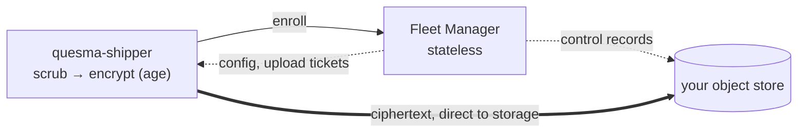

# Quesma Shipper

[](#download)

Quesma Shipper collects the session files that AI coding agents write on developer machines,
removes secrets and personal data from each file, encrypts it, and uploads the ciphertext to object
storage your organisation controls. This repository holds both parts of that system:

- **the shipper** (`src/`), which runs in the background on each developer machine: one static Go
  binary for macOS, Linux and Windows;
- **[Fleet Manager](fleet-manager/)** (`fleet-manager/`), the control plane: it enrolls shippers,
  hands them their configuration, and signs each upload. It never sees file contents.



Files are scrubbed and encrypted on the machine that wrote them, then uploaded straight to storage
through short-lived presigned URLs. Fleet Manager keeps its own state as small JSON objects in the
same bucket, and needs no database and no local disk. Only the holders of the organisation's
[age](https://age-encryption.org/) keys can read what was uploaded; an operator with full access to
the bucket sees object names, sizes and timestamps, but no contents.

Supported agents: Claude Code, Codex, Cursor.

Supported platforms: macOS 13 or newer (app bundle, launchd service), Linux (systemd user
service), Windows 10 1809 or newer (per-user installer, scheduled task).

## Get started

Start from what you already have:

| You have | Do this |
| --- | --- |
| A control plane your organisation runs, and an enrollment token | [Download](#download) the shipper and [enroll](#enroll) it |
| Nothing yet, and want to try the whole system on one machine | [Try it on one machine](#try-it-on-one-machine): MinIO, Fleet Manager and a shipper, no cloud account |
| Nothing yet, and want to run it for real | [Run it in your own cloud](#run-it-in-your-own-cloud): Fleet Manager on AWS or Google Cloud, shippers on developer machines |

Both ways of running it yourself start from a clone of this repository and the three decisions in
[Decide these first](#decide-these-first).

## Download

Every download below installs for the current user and needs no administrator rights. Released
builds keep themselves current from the signed update channel.

| Platform | Download |
|---|---|
| macOS 13+ | [quesma-shipper-macos-universal.pkg](https://updates.quesma.dev/download/quesma-shipper-macos-universal.pkg), or with Homebrew `brew install --cask quesmaorg/tap/quesma-shipper` |
| Windows 10 1809+ | [QuesmaShipperSetup-amd64.exe](https://updates.quesma.dev/download/QuesmaShipperSetup-amd64.exe) for x64, [QuesmaShipperSetup-arm64.exe](https://updates.quesma.dev/download/QuesmaShipperSetup-arm64.exe) for Arm |
| Linux | `curl -fsSLO https://raw.githubusercontent.com/QuesmaOrg/quesma-shipper/main/src/packaging/linux/install.sh && sh install.sh` |

Collection, scrubbing, and preview work straight away. Uploading needs enrollment against a
control plane: your organisation's, or one you run yourself ([Get started](#get-started)). See
[Install](#install) for the full instructions, [Enroll](#enroll) for enrollment, and
[RELEASE_DOWNLOADS.md](RELEASE_DOWNLOADS.md) for the trust boundary these links sit behind.

## Status

The project is pre-1.0. The wire protocol, the configuration format, and the object naming are
versioned and pinned by tests. They can still change between minor releases.

The shipper needs a control plane to send data. Without one it runs in local development mode:
collection, scrubbing, and preview work, and upload is disabled.

The public update channel is the supported way to install the shipper and stay current. Released
builds update themselves from its signed TUF repository. See
[Versions and releases](#versions-and-releases).

`trajectory-shipper` remains the wire identifier and on-disk configuration/state namespace.
Those protocol-facing names are separate from the user-facing Quesma Shipper package and command.

## Decide these first

Three settings shape an organisation. Two of them only act on files uploaded after they are set, so
decide them before the first shipper enrolls.

**1. The age recipients, and who holds them.** An organisation needs **at least two distinct public
recipients**, held by separate people: two custodians is the smallest arrangement that survives one
of them leaving. Each custodian generates their own and hands over only the public half:

```sh
age-keygen -o acme-security.agekey     # the private identity -- never leaves the custodian
age-keygen -y acme-security.agekey     # prints the age1… recipient -- this is what you collect
```

Whoever runs an ETL that reads the archive needs a private identity too, so in practice one
recipient belongs to the ETL and the rest are custody copies. Files are sealed to the recipients
registered when they are uploaded; changing the recipients later does not re-encrypt anything.

> [!WARNING]
> If every private identity is lost, nobody can decrypt the uploaded files, and nothing reports it:
> shippers keep enrolling and uploading normally.

**2. Whether Quesma may decrypt.** `allow_quesma_etl` is **on unless you turn it off.** While it is
on, Fleet Manager adds Quesma's built-in public recipient to every configuration it serves, so what
is sealed from then on can also be opened by Quesma, for its dashboards and analytics. On its own
that grants nothing: Quesma holds no bucket access until you grant it one. It is on by default
because sealing cannot be added after the fact; turning it on later covers only uploads from then
on. Turn it off per organisation (the checkbox when you create it), or for every organisation that
never chose with `default_allow_quesma_etl = false` in the Terraform. Set it before the first upload
if nothing should ever be sealed to Quesma.

**3. Where operational telemetry goes.** Shippers report their own failures to Fleet Manager, which
forwards them only if a collector is named. None is by default. Name one for every organisation with
`default_telemetry_collector_url` in the Terraform, or per organisation through the admin API
(`telemetry_collector_url`). This one can be changed at any time and applies immediately. See
[fleet-manager/TELEMETRY.md](fleet-manager/TELEMETRY.md).

## Try it on one machine

MinIO, Fleet Manager and a shipper on a single machine, built from this repository. Nothing
connects to a cloud provider. Use this to evaluate the system, to develop against it, or to
demonstrate it.

You need Docker (for MinIO), Go 1.27 or newer, the AWS CLI, `age` and `age-keygen`, `openssl` and
`curl`, on macOS or Linux; `zstd` and `tar` to look inside what arrives.

### 1. Storage and Fleet Manager

```sh
git clone https://github.com/QuesmaOrg/quesma-shipper
cd quesma-shipper
make -C fleet-manager run
```

This starts a MinIO container named `fleet-minio` on `127.0.0.1:9000`, creates the `trajectories`
bucket with versioning on, mints an administrator credential, and serves Fleet Manager on
`127.0.0.1:8099` in the foreground. It prints:

```
  storage      http://127.0.0.1:9000   bucket trajectories, versioning on
  credential   fma1.…
               kept in data/admin-credential -- this is the only copy
  admin UI     http://127.0.0.1:8099/admin/
```

Leave it running and continue in a second terminal. Ctrl-C stops it; the bucket and the credential
survive, and running it again reuses both. `DEV_PORT=` moves it off 8099; the other settings,
including pointing it at another store, are in the
[Fleet Manager README](fleet-manager/README.md#run-it).

### 2. The organisation

Open `http://127.0.0.1:8099/admin/`, paste the credential, and create an organisation: a lowercase
slug (`acme` in the commands below; use your own), a display name, the **two age recipients** from
[decision 1](#decide-these-first), and the Quesma ETL checkbox from decision 2. The slug is
permanent: it is part of every object key.

Before enrolling any machine, check that a custodian can decrypt files sealed to those recipients:

```sh
echo test | age -r age1… -r age1… -o test.age     # the two recipients you just registered
age -d -i acme-security.agekey test.age           # a custodian, with their private identity
```

Then create one invite on the Invites page. It is single-use, and its secret, an `fmi2.…` token, is
shown only once. A grant, on the Grants page, is the same for any number of machines.

### 3. The shipper

```sh
make build        # bin/quesma-shipper
```

**Pin the upload target before enrolling.** The local MinIO is plain HTTP and addressed path-style,
and the shipper refuses an upload ticket that is not HTTPS unless told otherwise. That pin lives in
the shipper's own user configuration and only there: a presigned ticket authorises itself, so a
served document that could write the pin could also loosen it.
`~/.config/trajectory-shipper/config.yaml`:

```yaml
upload_targets:
  - origin: http://127.0.0.1:9000
    addressing: path-style
    path_prefix: /trajectories
    allow_loopback_http: true
```

Then install your build, register the background service, and enroll, in one command. `--from`
uses your binary instead of downloading a release, on Linux and on macOS:

```sh
sh src/packaging/linux/install.sh --from bin/quesma-shipper fmi2.… --server http://127.0.0.1:8099
~/.local/bin/quesma-shipper doctor
```

It installs into `~/.local/bin` for your user; do not run it as root. On a machine that already has
a shipper installed, this replaces it. `--no-service` enrolls without registering the service.

### 4. Check that it arrived

`doctor` confirms that the machine enrolled and received its configuration, not that an upload
succeeded. The service ships on start and then every 15 minutes; list what it uploaded:

```sh
export AWS_ACCESS_KEY_ID=localadmin AWS_SECRET_ACCESS_KEY=localadmin-secret AWS_REGION=us-east-1
aws s3 ls --recursive --endpoint-url http://127.0.0.1:9000 \
  s3://trajectories/v1/organization=acme/install=
```

Every object sits under its install's own prefix. Open one with a custodian's identity; inside is
the scrubbed file and its manifest:

```sh
aws s3 cp --endpoint-url http://127.0.0.1:9000 "s3://trajectories/<key from the listing>" object.age
age -d -i acme-security.agekey object.age | zstd -d | tar -t     # manifest.json, payload
```

When you are done: Ctrl-C Fleet Manager, `docker rm -f fleet-minio`, and delete
`fleet-manager/data/`.

## Run it in your own cloud

Terraform creates the bucket, the scoped roles, the service and the administrator credential; the
shippers go on developer machines as usual. The steps below are for AWS. Google Cloud follows the
same shape with [fleet-manager/terraform/gcp](fleet-manager/terraform/gcp/README.md).

You need Terraform 1.5 or later (or OpenTofu); the AWS CLI with a profile allowed to create S3, IAM,
CloudWatch Logs and ECS Express Mode resources; a default VPC with two public subnets in different
availability zones, which ECS Express Mode requires; Docker and Go 1.27 or newer to build the image;
and `age-keygen` and `curl`.

### 1. Build and push your image

Build from your clone and push to your own registry, so you control the supply chain:

```sh
git clone https://github.com/QuesmaOrg/quesma-shipper
cd quesma-shipper/fleet-manager
make check                                  # the gate: formatting, vet, licenses, tests

export AWS_REGION='eu-central-1'
export REGISTRY='123456789012.dkr.ecr.eu-central-1.amazonaws.com'
rev=$(git rev-parse --short=12 HEAD)

aws ecr get-login-password --region "$AWS_REGION" \
  | docker login --username AWS --password-stdin "$REGISTRY"

docker buildx build --platform linux/amd64 --target cloud-run \
  --build-arg VERSION="$(cat VERSION)+$rev" \
  -t "$REGISTRY/fleet-manager:$rev" --push .

docker buildx imagetools inspect "$REGISTRY/fleet-manager:$rev" \
  --format '{{json .Manifest.Digest}}' | tr -d '"'          # deploy this digest, not the tag
```

`linux/amd64` is the architecture ECS Express Mode, Cloud Run and Azure Container Apps all accept.
Without `--build-arg VERSION` the running service reports `dev`, which is indistinguishable from a
laptop build months later. Deploying by digest rather than by tag rules out the service coming up
on an image you did not build. If you prefer not to build, the templates default to
`docker.io/quesma/fleet-manager:latest`, a moving tag Quesma publishes, which most on-premise
deployments will want to avoid.

### 2. Deploy

```sh
export BUCKET='globally-unique-acme-trajectories'      # S3 bucket names are global

cd terraform/aws
terraform init
terraform apply \
  -var="region=$AWS_REGION" \
  -var="bucket=$BUCKET" \
  -var="image_uri=$REGISTRY/fleet-manager@sha256:…"     # the digest from step 1
```

Add `-var='default_allow_quesma_etl=false'` or `-var='default_telemetry_collector_url=…'` here if
decisions 2 or 3 call for them. This creates a private, versioned bucket; a runtime role that is
almost write-only below `install=`; a lifecycle rule for superseded check-in records; a 30-day log
group; and a public HTTPS service. Then:

```sh
export FLEET_MANAGER_URL="$(terraform output -raw service_url)"
curl --fail --silent --show-error "${FLEET_MANAGER_URL%/}/healthz"     # ok
terraform output -raw admin_url
terraform output -raw admin_credential
```

[fleet-manager/terraform/aws/README.md](fleet-manager/terraform/aws/README.md) is the full runbook
for this step, including authenticating the AWS CLI and rotating the credential.

### 3. The organisation

As in [Try it on one machine](#2-the-organisation), at `admin_url` with the credential from
`terraform output`: the same recipients, the same custody check, an invite or a grant.

### 4. The shippers

On each developer machine, install the shipper from [Download](#download) and enroll it with the
invite or grant:

```sh
quesma-shipper login fmi2.… --server "$FLEET_MANAGER_URL"
```

No `upload_targets` pin is needed: S3 is served over HTTPS with virtual-host addressing, which the
shipper allows by default. To enroll a build from source instead, use `install.sh --from` as in
[step 3](#3-the-shipper) with `--server "$FLEET_MANAGER_URL"`.

### 5. Check that it arrived

```sh
aws s3 ls --recursive "s3://$BUCKET/v1/organization=acme/install=" | head
```

Then open one object with a custodian's identity, as on one machine. What comes next, from
rotating the credential and upgrading to backups, letting an outside ETL read and running without
egress, is in [fleet-manager/OPERATIONS.md](fleet-manager/OPERATIONS.md), together with why the
installation order matters and how to prepare the bucket by hand.

## The shipper

What runs on each developer machine: how it works, what it collects, and how to install, use and
configure it.

### How it works

```
agent session files ──► discover ──► detect change ──► read ──► scrub ──► encrypt ──► upload ──► commit
                        (catalog)    (size, mtime,              (rule     (age, to     (presigned  (local
                                      content hash)              packs)    org keys)    PUT)        record)
```

- **Sources.** A compiled catalog describes where each agent stores sessions and how to read them.
  This includes live SQLite databases. The shipper never writes inside an agent's store.
- **Scrub.** Every file passes through redaction rule packs first. Three provider-key packs
  (`gitleaks-core`, `quesma-extra`, `cloud-keys`), an entropy backstop (`generic-entropy`), and a
  PII pack (`pii-core`) are compiled in. The control plane can add packs. It cannot remove them.
  A scrub error means the file is not uploaded.
- **Encrypt.** The scrubbed file is sealed with age to the recipients that the control plane
  supplies. The client can be configured to hold no key that decrypts what it ships.
- **Upload.** The control plane authorises each upload with a presigned URL. Ciphertext goes from
  the client directly to the sink. The control plane never receives trajectory bytes. No cloud SDK
  is linked. The upload path is `net/http` only.
- **Commit.** A local record of shipped files is updated after the sink confirms the write. That
  record is the authority for resume.
- **Update.** Release builds check a [TUF](https://theupdateframework.io/) repository. They replace
  themselves when a newer signed release exists. Development builds do not self-update.

The design rules are in [CONSTITUTION.md](CONSTITUTION.md). The code layout is in
[ARCHITECTURE.md](ARCHITECTURE.md). The wire contract is the public
[shipper-protocol](https://github.com/QuesmaOrg/shipper-protocol) module. This repository imports its schemas and
fixtures. Protocol changes are reviewed and released there.

### What is collected

The shipper collects more than chat transcripts. Per agent, from the agent's own directories:

| Agent | Trajectories | Context artifacts |
|---|---|---|
| Claude Code | Session and subagent transcripts, spilled tool results | Per-project memory files, plans, todos, file-history checkpoint metadata, the user-level `CLAUDE.md`, `settings.json` |
| Codex | Sessions, archived and compressed sessions, the session index | None |
| Cursor | Agent transcripts, enriched with conversation text, tool calls, and model names read from Cursor's database | Spilled tool output, terminal captures, agent scratchpad notes |

Two more records are produced by the shipper itself:

- **Project map.** For each project directory an agent used: the directory name, the working
  directory, and the git remote as host and path. Credentials embedded in a remote URL are removed
  before the value is written anywhere.
- **Account and usage history.** Independent Claude Code, Codex, and Cursor collectors upload
  account metadata and provider usage JSON in UTC buckets matching the collection interval (default 15 minutes). Unknown fields are preserved;
  these records skip scrubbing and ship encrypted.

All other files above pass through the scrub stage before encryption. The control plane receives no
file content. It receives the install id, hostname, platform, and agent version in each heartbeat.

Never uploaded as files: credential stores such as Claude Code's `.credentials.json` and
`~/.claude.json`, Codex's `auth.json`, and Cursor's `state.vscdb`. A compiled deny list blocks
these paths even when a configured glob would match them. Collectors and enrichers read only
the data they need from these stores:

- Account collectors read account metadata and use credentials only to authenticate provider requests.
- The Cursor enricher reads conversation records from `state.vscdb` and writes the conversation
  text, tool calls, and model names it finds into the transcript record, because Cursor's own
  transcript files lack them. The `cursorAuth/*` keys and the encryption-key fields are stripped
  by a compiled rule that no configuration layer can disable.

Everything derived this way passes through the scrub stage like any other file.

`quesma-shipper tracking` shows what is collected on this machine, per agent and repository.
`quesma-shipper preview` shows what the next run would send, after scrubbing, without sending it.

### Install

#### From a release

Release builds, including Homebrew installations, use the signed TUF repository to update themselves. The public
repository and stable download endpoints are described in
[RELEASE_DOWNLOADS.md](RELEASE_DOWNLOADS.md).

**macOS**

With Homebrew already installed:

```sh
brew install --cask quesmaorg/tap/quesma-shipper
```

The cask installs the command on your Homebrew `PATH` and starts a per-user background service,
which waits for enrollment. It supports macOS 13 or newer on Apple Silicon and Intel, without
administrator rights. Run the login command below after installing.

The shipper updates itself automatically; run `quesma-shipper update` to update immediately.
Use `brew uninstall --cask quesmaorg/tap/quesma-shipper` to remove it. Uninstall keeps enrollment and
upload history. Add `--zap` to delete local state too, using the shipper's configured state directory.
Before switching between Homebrew and the `.pkg`, uninstall the previous installation
without purging local state.

Without Homebrew:

Download and install the signed
[`quesma-shipper-macos-universal.pkg`](https://updates.quesma.dev/download/quesma-shipper-macos-universal.pkg).
It installs `Quesma Shipper.app` for the current user and registers a launchd agent. It does not
need administrator rights.

**Linux**

```sh
curl -fsSLO https://raw.githubusercontent.com/QuesmaOrg/quesma-shipper/main/src/packaging/linux/install.sh
sh install.sh
```

The script downloads a hash-pinned bootstrap binary and installs a systemd user service. Run it
again to upgrade. Existing enrollment is kept. Use `--no-service` to skip the service.

The released binaries are also available directly for
[AMD64](https://updates.quesma.dev/targets/3ae805e2d630af5cb52fff51a5c8ae77aeb7b12f2d73a56fd7723698e9bfe48e.shipper-linux-amd64)
and
[ARM64](https://updates.quesma.dev/targets/78f0c89019d8a2f86fe3723359c00082ba9ec6ddedfc5fde1709f7516c33a3b0.shipper-linux-arm64).

**Windows**

Download [QuesmaShipperSetup-amd64.exe](https://updates.quesma.dev/download/QuesmaShipperSetup-amd64.exe)
on an x64 PC or [QuesmaShipperSetup-arm64.exe](https://updates.quesma.dev/download/QuesmaShipperSetup-arm64.exe)
on an Arm PC and run it as your normal user. The setup installs the command under `%LOCALAPPDATA%`, adds it to
your user `PATH`, and registers a scheduled task that starts immediately and at login without
administrator rights. Re-running setup repairs that integration without changing enrollment.

For managed deployments, follow the [Intune setup guide](src/packaging/windows/intune/README.md).
It includes user-context installation and unattended enrollment, a platform-script route you can
configure from macOS, and a Win32 app package route with detection and uninstall scripts.

Windows release signing is temporarily disabled while the publisher identity is validated. Until
it is restored, Microsoft Defender SmartScreen may warn about the download, and managed devices
whose application-control policy requires a trusted publisher may block it.

The raw `quesma-shipper-windows-<arch>.exe` files remain available for portable use and are the
payloads installed by the TUF self-updater. A portable copy has no scheduled task or uninstaller.

#### From source

You need Go 1.27 or newer. No other tool is required. `make doctor` lists the optional ones.

**The control plane first**, unless you already have one to enroll against. A shipper cannot upload
until it is enrolled, and enrollment needs a server to enroll with:

```sh
make -C fleet-manager run     # MinIO, the bucket, a credential, serving on 127.0.0.1:8099
```

[Try it on one machine](#try-it-on-one-machine) covers what to do with it: the organisation, its
recipients, and the invite you enroll with.

**Then the shipper.** `install.sh --from` installs your own build the way a release installs
itself, with the background service, on Linux and on macOS:

```sh
make build                                     # bin/quesma-shipper
sh src/packaging/linux/install.sh --from bin/quesma-shipper
```

`make install` puts the binary in GOBIN instead, for running it by hand: no background service, and
no self-updating either way. Development builds report their commit and never fetch a release.

Then [enroll](#enroll) it.

#### Enroll

Every new shipper must be enrolled with a control plane. Your administrator gives you an
enrollment token and the server address; if you run [Fleet Manager](fleet-manager/) yourself,
[Get started](#get-started) shows how to create them. The command is the same on every platform:

```sh
quesma-shipper login <enrollment-token> --server https://cp.example.com
```

To run the pipeline without a control plane:

```sh
bin/quesma-shipper local-dev      # create a local identity and state directory
bin/quesma-shipper preview        # show what would be collected and how it would be scrubbed
```

### Usage

```
quesma-shipper                Status: is it on, what is collected, what is waiting to be sent
quesma-shipper login <token>  Join your organisation with the token from your admin
quesma-shipper tracking       What is collected, per agent and repository
quesma-shipper pause [dur]    Stop collecting for 15m, 1h, 6h, 12h, 24h, or until tomorrow 9:00
quesma-shipper resume         Start collecting again
quesma-shipper doctor         Check collecting and sending, explain anything wrong
quesma-shipper update         Install the newest release
quesma-shipper uninstall      Remove the service and program, keep local state
quesma-shipper licenses       Print the license and the third-party notices
```

Debug commands. These are not shown in `--help`:

```
quesma-shipper run [--once|--drain] [-q]   Run the scheduler loop in the foreground, log to stderr
quesma-shipper preview                      Show what would be sent, without sending or recording anything
quesma-shipper config [--with-provenance]   The effective configuration and where each value came from
quesma-shipper log                          Recent audit entries: what was decided about each file
quesma-shipper state reset|prune            Inspect and repair the local record of what was sent
quesma-shipper service uninstall|restart    Manage the background service entry
quesma-shipper local-dev                    Set up without a control plane
```

### Configuration

Configuration is resolved from four layers, in this order: compiled defaults, the source catalog,
the user file, the document served by the control plane. `quesma-shipper config --with-provenance` prints
each effective value and the layer that set it.

The served document has limited authority. A rulebook in the
[shipper-protocol](https://github.com/QuesmaOrg/shipper-protocol) module states, field by field, what the control plane
can change. For example, it can add scrub rule packs. It cannot remove them. It cannot turn off
scrub or encryption. Contract tests here and in the control plane enforce the rulebook.

File locations. `XDG_CONFIG_HOME` and `XDG_STATE_HOME` are honoured.

| Path | Contents |
|---|---|
| `~/.config/trajectory-shipper/config.yaml` | Optional user layer |
| `~/.local/state/trajectory-shipper/` | Identity, upload record, audit log, run logs |

Defaults: a 15-minute schedule, a maximum of 512 files per run, a 5-minute drain deadline.

Environment variables:

| Variable | Effect |
|---|---|
| `SHIPPER_AUTH_KEY` | Supplies the login token without a prompt |
| `SHIPPER_NO_SELFUPDATE` | Any value disables the self-update check |

### Security model

- Trajectory files contain prompts, source code, shell output, and often credentials. Treat local
  state, logs, and encrypted bundles as confidential.
- Scrub and encrypt are mandatory pipeline stages in every build. No configuration layer can
  remove them.
- The control plane distributes configuration and authorises uploads. It does not proxy, receive,
  or store trajectory content.
- Uploads use per-object presigned URLs. The client holds no long-lived storage credential.
- One install cannot overwrite another install's objects. The object-key grammar and the per-upload
  authorisation enforce this.
- Updates are verified against an offline-signed TUF root that is embedded in the binary.

Report vulnerabilities as described in [SECURITY.md](SECURITY.md).

## Fleet Manager

Fleet Manager is one stateless service with an administration UI and an admin API. It serves
many organisations from one bucket: their configuration, enrollment grants and invites, and install
records live below `v1/organization=<org>/control/`, and the shippers' sealed objects below
`v1/organization=<org>/install=<id>/`. It has no decrypt path and no delete operation.

- [fleet-manager/README.md](fleet-manager/README.md): running it locally, the admin UI and API, how
  install names and telemetry work;
- [fleet-manager/OPERATIONS.md](fleet-manager/OPERATIONS.md): operating a deployment;
- [fleet-manager/terraform/](fleet-manager/terraform/): the AWS and Google Cloud templates;
- [fleet-manager/SECURITY.md](fleet-manager/SECURITY.md): what is in scope for the control plane.

## Repository layout

```
src/           Go module root
  cmd/quesma-shipper/   main
  app/           composes a run
  internal/      pipeline stages, config, control-plane client, platform floor
  packaging/     install, service, and update mechanics per OS
  internal/legal embedded LICENSE, NOTICE, and third-party license texts
  e2e/           hermetic end-to-end and golden tests
Makefile       repository-level build and test entry points
fleet-manager/ the control plane: its own Go module, Makefile, VERSION, NOTICE and third_party/
  src/           the service and its embedded administration UI
  terraform/     deployment templates for AWS and Google Cloud
```

## Build and test

```sh
make build       # bin/quesma-shipper
make test        # unit suite and local end-to-end tests
make race        # the same under the race detector
make check       # the commit gate: fmt, vet, version, dead code, licenses, race
make perf-smoke  # PR-sized performance gates, needs Docker
make perf        # full performance suite, needs Docker
make help        # every target
```

CI runs `make check` and `make perf-smoke`. `make perf` runs the full performance tier against a
local MinIO and Toxiproxy. Both perf targets need Docker and are skipped without it.

Installers come from the same tree. `make macos-pkg RELEASE_VERSION=<version>` builds the macOS
package, on macOS only, and `make dist RELEASE_VERSION=<version>` cross-compiles both Windows
binaries. On Windows with Inno Setup installed:

```powershell
src/packaging/windows/build-setup.ps1 -ReleaseVersion <version> -Architecture amd64 `
  -BinaryPath <binary> -SupervisorPath <supervisor-binary> -OutputDir bin/dist
```

Fleet Manager builds and checks on its own: `make -C fleet-manager check` (Go, plus Node 22 for the
administration UI's tests), which CI runs on every pull request as well. Tests that run the shipper
against a live Fleet Manager are not part of this repository yet.

## Versions and releases

`VERSION` contains the reviewed `MAJOR.MINOR.PATCH` release line. Change it only to start a new
line. `make version-check` validates it. Release builds are stamped
`<VERSION>-<commit count>.<short sha>` by `scripts/release-version.sh`. `make release-version`
prints the stamp. Development builds are not stamped. They report their commit and do not
self-update.

A push to `main` that touches the shipper builds six platform binaries and the macOS package, signs
TUF metadata, and publishes to `https://updates.quesma.dev`. It then creates a
[GitHub release](https://github.com/QuesmaOrg/quesma-shipper/releases) linking the stable downloads.
The first release through this workflow was published on 2026-09-04. A maintainer approves each
publication.

Each GitHub release also carries a `quesma-shipper.rb` cask pinned to the published macOS binaries.
The [Homebrew tap](https://github.com/QuesmaOrg/homebrew-tap) imports it hourly or on a manual workflow
run. See [Homebrew packaging](src/packaging/homebrew/README.md) for the first-release rollout and checks.

## Contributing

See [CONTRIBUTING.md](CONTRIBUTING.md) and [CODE_OF_CONDUCT.md](CODE_OF_CONDUCT.md). Do not attach
real trajectories, agent databases, logs, or credentials to issues or pull requests.

## License

Apache License 2.0. See [LICENSE](LICENSE) and [NOTICE](NOTICE). `quesma-shipper licenses` prints the
license and every bundled dependency's license text; the same texts ship inside the macOS app
bundle and are kept in `src/internal/legal/third_party/` with an inventory in `licenses.csv` that
covers Linux, macOS, and Windows builds. `make licenses` regenerates them after a dependency change.
`make check` fails when they are stale or when a dependency is not under a permissive license.
Fleet Manager keeps its own: [fleet-manager/NOTICE](fleet-manager/NOTICE) and
`fleet-manager/third_party/`, regenerated by `make -C fleet-manager licenses`.

Quesma, Quesma Shipper, Quesma Fleet Manager, and the Quesma logo are trademarks of Quesma Inc.
The license does not grant trademark rights. If you distribute a modified build, read
[TRADEMARKS.md](TRADEMARKS.md) before you name it.
