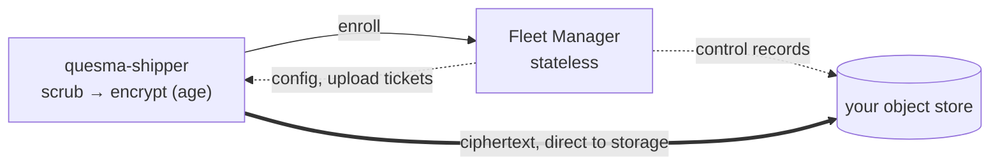

# Quesma Shipper

[](#developer-install-the-shipper-each-machine)

Quesma Shipper collects the session files that AI coding agents write on developer machines,
redacts the secrets and personal data its rules detect in transcripts and context files, encrypts
everything, and uploads the ciphertext to object storage your organisation controls. It is two
parts: **the shipper** ([`src/`](src/README.md)), a background service on each developer machine,
and **[Fleet Manager](fleet-manager/)**, the control plane you run in your own cloud, which enrolls
shippers and signs each upload but never sees file contents.


```mermaid
flowchart LR
    S["quesma-shipper<br/>scrub → encrypt (age)"]
    F["Fleet Manager<br/>stateless"]
    B[("your object store")]

    S -->|enroll| F
    F -.->|"config, upload tickets"| S
    F -.->|"control records"| B
    S ==>|"ciphertext, direct to storage"| B
```

Each upload is sealed to the organisation's [age](https://age-encryption.org/) recipients, and any
one of their private keys can decrypt it: your custodians' and, unless you turn Quesma ETL off,
Quesma's. Account and usage records are encrypted but not scrubbed.

Supported agents: Claude Code, Codex, Cursor, GitHub Copilot (the Copilot CLI and Copilot Chat in
VS Code), Pi\*, OpenCode\*, Hermes\*. Supported platforms: macOS 13 or newer, Linux, Windows 10
1809 or newer. The project is pre-1.0: the wire protocol, the configuration format and the object
naming are pinned by tests but can still change between minor releases.

\* Experimental. We actively run and test Claude Code, Codex, and Cursor.
Pi, OpenCode, and Hermes support may change or be withdrawn.

## Get started

| | |
| --- | --- |
| **Try it first** | [**WALKTHROUGH.md**](fleet-manager/WALKTHROUGH.md): every step below on a throwaway deployment, a container as the developer machine, torn down at the end. About fifteen minutes. |
| **Set it up** | [Operator: set up Fleet Manager](#operator-set-up-fleet-manager-once), once, in your AWS account or Google Cloud project. |
| **Join it** | [Developer: install the shipper](#developer-install-the-shipper-each-machine), on each machine. |

## Operator: set up Fleet Manager (once)

1. **Have ready:** an AWS account or Google Cloud project you can create resources in, and on your
   laptop Terraform or OpenTofu, `curl`, `age`, `age-keygen`, `zstd`, and the `aws` CLI signed in,
   or `gcloud` with `gcloud auth application-default login`. On AWS the Region needs a default VPC.

2. **Decide two things** before anything enrolls. Ask two custodians to each run `age-keygen -o
   name.agekey` and send you only their `age1…` public recipient (`age-keygen -y name.agekey`
   prints it); their private identities are your only way to read what is uploaded, so they
   must be kept and backed up. Decide whether Quesma may decrypt uploads, for its dashboards; it is
   on unless you say `--no-quesma-etl` below, and cannot be added to files already uploaded.

3. **Deploy:**

   ```sh
   curl -fsSLO https://raw.githubusercontent.com/QuesmaOrg/quesma-shipper/main/fleet-manager/deploy.sh

   sh deploy.sh aws --bucket globally-unique-acme-trajectories --region eu-central-1   # AWS, or
   sh deploy.sh gcp --project acme-prod --region europe-central2                        # Google Cloud
   ```

   It shows the plan, asks for `yes`, and after a few minutes prints the service URL, the admin UI
   address and the admin credential. Keep `~/.quesma/fleet-manager/<cloud>/` backed up, since the
   Terraform state is there. Running the same command again applies the latest template; upgrading
   the service image is in [OPERATIONS.md](fleet-manager/OPERATIONS.md). `sh deploy.sh aws output
   admin_credential` prints the credential again; `sh deploy.sh --help` lists the rest.

4. **Open the admin UI**, paste the credential, and create the organisation: a slug such as `acme`
   (permanent, it is part of every object key), a display name, the two recipients, the Quesma
   checkbox. Verify a custodian can decrypt a test file sealed to those recipients:

   ```sh
   echo test | age -r age1… -r age1… -o test.age     # the two recipients you registered
   age -d -i name.agekey test.age                    # a custodian, with their private identity
   ```

5. **On the Invites page**, create one invite per developer; its `fmi2.…` token is shown once.
   Send the token and the service URL to each developer through a secret-sharing channel. Each OS
   user on a machine enrolls separately, as its own install. A grant, on the Grants page, enrolls
   any number of installs until it expires or is revoked, which suits shared machines and MDM
   rollouts.

6. **Later, check a session arrived** and decrypt it with a custodian key. `active` on the
   Installs page means a machine enrolled, not that it has shipped anything.

   ```sh
   B=$(sh deploy.sh aws output bucket)
   KEY=$(aws s3api list-objects-v2 --bucket "$B" --prefix 'v1/organization=acme/install=' \
     --query "Contents[?contains(Key, 'claude-code-transcripts')].Key | [0]" --output text)
   aws s3 cp "s3://$B/$KEY" object.age
   age -d -i name.agekey object.age | zstd -d | tar -t     # manifest.json, payload
   ```

   On Google Cloud, `gcloud storage ls --recursive` on the bucket lists the same keys.

What the script creates, and running the template by hand with your own image or your own
state: [fleet-manager/terraform/aws](fleet-manager/terraform/aws/README.md),
[fleet-manager/terraform/gcp](fleet-manager/terraform/gcp/README.md). Rotating the credential,
revoking installs, upgrading, backups and letting an outside ETL read the bucket:
[fleet-manager/OPERATIONS.md](fleet-manager/OPERATIONS.md). Everything on one laptop instead, with
no cloud account: [On one machine](fleet-manager/README.md#on-one-machine).

## Developer: install the shipper (each machine)

1. **Install.** Personal installations need no administrator rights. The macOS package and
   Windows setup also offer an administrator-managed all-users installation.
   - macOS: `brew install --cask quesmaorg/tap/quesma-shipper`, or the signed
     [quesma-shipper-macos-universal.pkg](https://updates.quesma.dev/download/quesma-shipper-macos-universal.pkg)
   - Linux: `curl -fsSLO https://raw.githubusercontent.com/QuesmaOrg/quesma-shipper/main/src/packaging/linux/install.sh && sh install.sh`
   - Windows: run [QuesmaShipperSetup-amd64.exe](https://updates.quesma.dev/download/QuesmaShipperSetup-amd64.exe)
     (x64) or [QuesmaShipperSetup-arm64.exe](https://updates.quesma.dev/download/QuesmaShipperSetup-arm64.exe) (Arm)

2. **Enroll** with the token and URL the operator sent:

   ```sh
   quesma-shipper login <token> --server https://fleet-manager-url
   ```

3. **Run `quesma-shipper doctor`.** It should say it is sending to your organisation. The service
   ships on start and then every 15 minutes, and keeps itself up to date.

Uninstalling, MDM and Intune deployment, what is collected, and how to pause or configure it:
[src/README.md](src/README.md).

## Learn more

[fleet-manager/WALKTHROUGH.md](fleet-manager/WALKTHROUGH.md) rehearses everything above on a
throwaway deployment; [fleet-manager/README.md](fleet-manager/README.md) covers the control plane;
[CONSTITUTION.md](CONSTITUTION.md) the design rules; [ARCHITECTURE.md](ARCHITECTURE.md) the code
layout; [CONTRIBUTING.md](CONTRIBUTING.md) building, testing and releases; [SECURITY.md](SECURITY.md)
reporting a vulnerability. The wire contract is the [shipper-protocol/](shipper-protocol/) module.
Do not attach real
trajectories, agent databases, logs or credentials to issues or pull requests.

## License

Apache License 2.0. See [LICENSE](LICENSE) and [NOTICE](NOTICE). `quesma-shipper licenses` prints the
license and every bundled dependency's license text; Fleet Manager keeps its own in
[fleet-manager/NOTICE](fleet-manager/NOTICE) and `fleet-manager/third_party/`. Quesma, Quesma
Shipper, Quesma Fleet Manager, and the Quesma logo are trademarks of Quesma Inc.; the license does
not grant trademark rights. If you distribute a modified build, read [TRADEMARKS.md](TRADEMARKS.md)
before you name it.
