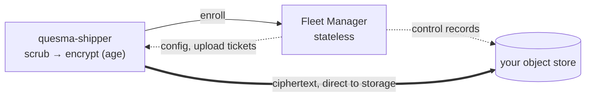

# Quesma Shipper

[](#install-the-shipper)

Quesma Shipper collects the session files that AI coding agents write on developer machines,
removes secrets and personal data from each file, encrypts it, and uploads the ciphertext to object
storage your organisation controls. It is two parts:

- **the shipper** ([`src/`](src/README.md)), a background service on each developer machine: one
  static binary for macOS, Linux and Windows;
- **[Fleet Manager](fleet-manager/)**, the control plane you run in your own cloud: it enrolls
  shippers, hands them their configuration, and signs each upload. It never sees file contents.


```mermaid
flowchart LR
    S["quesma-shipper<br/>scrub → encrypt (age)"]
    F["Fleet Manager<br/>stateless"]
    B[("your object store")]

    S -->|enroll| F
    F -.->|"config, upload tickets"| S
    F -.->|"control records"| B
    S ==>|"ciphertext, direct to storage"| B
```

Files are scrubbed and encrypted on the machine that wrote them, then uploaded straight to storage
through short-lived presigned URLs. Fleet Manager keeps its own state as small JSON objects in the
same bucket, and needs no database and no local disk. Only the holders of the organisation's
[age](https://age-encryption.org/) keys can read what was uploaded; an operator with full access to
the bucket sees object names, sizes and timestamps, but no contents.

Supported agents: Claude Code, Codex, Cursor.

Supported platforms: macOS 13 or newer (app bundle, launchd service), Linux (systemd user
service), Windows 10 1809 or newer (per-user installer, scheduled task).

## Get started

| You are | Start here |
| --- | --- |
| A developer whose organisation runs Fleet Manager | [Install the shipper](#install-the-shipper): install, enroll, check |
| Setting Fleet Manager up for your organisation | [Run Fleet Manager](#run-fleet-manager): one script in your AWS account or Google Cloud project |
| Evaluating, with no cloud account | [On one machine](#on-one-machine): everything on a laptop, built from this repository |

The project is pre-1.0. The wire protocol, the configuration format, and the object naming are
versioned and pinned by tests. They can still change between minor releases.

## Install the shipper

You need the address of your organisation's Fleet Manager and an enrollment token from its
administrator. Nothing is built; every download installs for the current user and needs no
administrator rights.

### 1. Install

| Platform | Install |
|---|---|
| macOS 13+ | `brew install --cask quesmaorg/tap/quesma-shipper`, or the signed [quesma-shipper-macos-universal.pkg](https://updates.quesma.dev/download/quesma-shipper-macos-universal.pkg) |
| Linux | `curl -fsSLO https://raw.githubusercontent.com/QuesmaOrg/quesma-shipper/main/src/packaging/linux/install.sh && sh install.sh` |
| Windows 10 1809+ | [QuesmaShipperSetup-amd64.exe](https://updates.quesma.dev/download/QuesmaShipperSetup-amd64.exe) for x64, [QuesmaShipperSetup-arm64.exe](https://updates.quesma.dev/download/QuesmaShipperSetup-arm64.exe) for Arm |

Each installs the `quesma-shipper` command and a per-user background service that waits for
enrollment. Released builds keep themselves current from Quesma's signed
[TUF](https://theupdateframework.io/) repository; `quesma-shipper update` updates at once.

**macOS.** The cask supports Apple Silicon and Intel. `brew uninstall --cask
quesmaorg/tap/quesma-shipper` removes it and keeps enrollment and upload history; add `--zap` to
delete local state too. The `.pkg` is the same thing without Homebrew: **Install for me only** puts
`Quesma Shipper.app` in `~/Applications`; **Install for all users** needs administrator
authorization and is updated by an administrator. Before switching between the two, uninstall the
previous installation without purging local state. For Jamf, Kandji and other MDM deployment, see
the [macOS MDM guide](src/packaging/macos/mdm/README.md).

**Linux.** The script downloads a hash-pinned bootstrap binary into `~/.local/bin` and installs a
systemd user service. Run it again to upgrade; enrollment is kept. `--no-service` skips the
service. Binaries are also available directly for
[AMD64](https://updates.quesma.dev/download/quesma-shipper-linux-amd64) and
[ARM64](https://updates.quesma.dev/download/quesma-shipper-linux-arm64).

**Windows.** Run the setup as your normal user. It installs under `%LOCALAPPDATA%`, adds the
command to your user `PATH`, and registers a scheduled task that starts immediately and at login.
Re-running setup repairs that integration without changing enrollment. For Intune, see the
[Intune guide](src/packaging/windows/intune/README.md). Release signing is temporarily disabled
while the publisher identity is validated, so Microsoft Defender SmartScreen may warn about the
download. The raw `quesma-shipper-windows-<arch>.exe` files remain available for portable use; a
portable copy has no scheduled task or uninstaller.

### 2. Enroll

Collection, scrubbing and preview work straight away; uploading does not, until the shipper is
enrolled. The command is the same on every platform:

```sh
quesma-shipper login <enrollment-token> --server https://fleet-manager.example.com
```

### 3. Check it enrolled

```sh
quesma-shipper doctor
```

`doctor` reports whether the machine enrolled and received its configuration. `quesma-shipper`
with no arguments shows whether it is on, what is collected, and what is waiting to be sent. The
service ships on start and then every 15 minutes. What is collected, how it is scrubbed, how to
pause, and how to configure it: [the shipper](src/README.md).

## Run Fleet Manager

One script creates the bucket, the scoped roles, the service and the administrator credential in
your AWS account or Google Cloud project, from Quesma's published image. You need Terraform 1.5 or
later (or OpenTofu), `curl`, `age-keygen`, and the `aws` or `gcloud` CLI signed in to the target
account; no clone, no Go, no Docker. On AWS you also need a default VPC in the Region with two
public subnets in different availability zones, which ECS Express Mode requires.

### Decide these first

Two settings shape an organisation. Both act only on files uploaded after they are set, so decide
them before the first shipper enrolls.

**1. The age recipients, and who holds them.** An organisation needs **at least two distinct
public recipients**, held by separate people: two custodians is the smallest arrangement that
survives one of them leaving. Each custodian generates their own and hands over only the public
half:

```sh
age-keygen -o acme-security.agekey     # the private identity -- never leaves the custodian
age-keygen -y acme-security.agekey     # prints the age1… recipient -- this is what you collect
```

Whoever runs an ETL that reads the archive needs a private identity too, so in practice one
recipient belongs to the ETL and the rest are custody copies. Files are sealed to the recipients
registered when they are uploaded; changing the recipients later does not re-encrypt anything.

> [!WARNING]
> If every private identity is lost, nobody can decrypt the uploaded files, and nothing reports it:
> shippers keep enrolling and uploading normally.

**2. Whether Quesma may decrypt.** `allow_quesma_etl` is **on unless you turn it off.** While it is
on, Fleet Manager adds Quesma's built-in public recipient to every configuration it serves, so
files sealed from then on can also be opened by Quesma, for its dashboards and analytics. On its
own that grants nothing: Quesma holds no bucket access until you grant it one. It is on by default
because sealing cannot be added after the fact. Turn it off per organisation, the checkbox when you
create it, or for every organisation that never chose with `--no-quesma-etl` below. Do it before
the first upload if nothing should ever be sealed to Quesma.

### 1. Deploy

```sh
curl -fsSLO https://raw.githubusercontent.com/QuesmaOrg/quesma-shipper/main/fleet-manager/deploy.sh

sh deploy.sh aws --bucket globally-unique-acme-trajectories --region eu-central-1
sh deploy.sh gcp --project acme-prod --region europe-central2
```

The script shows the plan, asks before applying, waits for the service to answer, and prints the
service URL, the admin UI address and the administrator credential. It takes a few minutes, most
of it the service starting. Everything it makes lives in `~/.quesma/fleet-manager/<cloud>/`,
including the Terraform state: back that directory up. Running the same command again upgrades;
`sh deploy.sh aws output admin_credential` prints the credential again; `sh deploy.sh --help` lists
the rest, including `--image` for an image you built yourself and `destroy`.

This creates a private, versioned bucket; a runtime role that writes below `install=` and reads
there only to name installs and deduplicate uploads (it can fetch ciphertext, never decrypt it); a
30-day log group; and a public HTTPS service. The templates themselves, for a registry of your own
or state kept elsewhere, are [fleet-manager/terraform/aws](fleet-manager/terraform/aws/README.md)
and [fleet-manager/terraform/gcp](fleet-manager/terraform/gcp/README.md).

### 2. Create the organisation

Open the admin UI address the script printed, paste the credential, and create an organisation: a
lowercase slug (`acme` below; use your own), a display name, the **two age recipients** from
decision 1, and the Quesma ETL checkbox from decision 2. The slug is permanent: it is part of every
object key.

Before enrolling any machine, check that a custodian can decrypt files sealed to those recipients:

```sh
echo test | age -r age1… -r age1… -o test.age     # the two recipients you just registered
age -d -i acme-security.agekey test.age           # a custodian, with their private identity
```

### 3. Invite the machines

On the Invites page, create one invite per machine. It is single-use, and its secret, an `fmi2.…`
token, is shown only once. A grant, on the Grants page, is the same for any number of machines.
Send the token and the service URL to the machine's owner through an approved secret-sharing
channel; they follow [Install the shipper](#install-the-shipper). The new install appears on the
Installs page with status `active`.

### 4. Check that it arrived

`doctor` on a machine confirms enrollment, not an upload. The service ships on start and then every
15 minutes; list what arrived, then open one object with a custodian's identity:

```sh
aws s3 ls --recursive "s3://$(sh deploy.sh aws output bucket)/v1/organization=acme/install=" | head
aws s3 cp "s3://<bucket>/<key from the listing>" object.age
age -d -i acme-security.agekey object.age | zstd -d | tar -t     # manifest.json, payload
```

On Google Cloud, `gcloud storage ls -r` and `gcloud storage cp` do the same.

### Afterwards

Rotating the credential, revoking installs, upgrading, backups, letting an outside ETL read the
bucket, and running without egress are in [fleet-manager/OPERATIONS.md](fleet-manager/OPERATIONS.md).
Fleet Manager also runs on Azure and on any S3-compatible store, without a template yet; the
[Fleet Manager README](fleet-manager/README.md) covers the executable and its flags.

## On one machine

MinIO, Fleet Manager and a shipper on a single machine, built from this repository. Nothing
connects to a cloud provider. You need Docker (for MinIO), Go 1.27 or newer, the AWS CLI, `age`
and `age-keygen`, `openssl` and `curl`, on macOS or Linux.

```sh
git clone https://github.com/QuesmaOrg/quesma-shipper
cd quesma-shipper
make -C fleet-manager run
```

This starts a MinIO container named `fleet-minio`, creates the `trajectories` bucket with
versioning on, mints an administrator credential, and serves Fleet Manager on port 8099 in the
foreground, printing the credential and the admin UI address. Leave it running and continue in a
second terminal. Create the organisation as in [step 2](#2-create-the-organisation) and an invite
as in [step 3](#3-invite-the-machines).

**Pin the upload target before enrolling.** The local MinIO is plain HTTP and addressed path-style,
and the shipper refuses an upload ticket that is not HTTPS unless told otherwise, in
`~/.config/trajectory-shipper/config.yaml`:

```yaml
upload_targets:
  - origin: http://127.0.0.1:9000
    addressing: path-style
    path_prefix: /trajectories
    allow_loopback_http: true
```

Then build the shipper, install your build with its background service, and enroll, in one
command; `--from` uses your binary instead of downloading a release, on Linux and on macOS:

```sh
make build
sh src/packaging/linux/install.sh --from bin/quesma-shipper fmi2.… --server http://127.0.0.1:8099
~/.local/bin/quesma-shipper doctor
```

List what it uploaded with the local store's credentials:

```sh
export AWS_ACCESS_KEY_ID=localadmin AWS_SECRET_ACCESS_KEY=localadmin-secret AWS_REGION=us-east-1
aws s3 ls --recursive --endpoint-url http://127.0.0.1:9000 s3://trajectories/v1/organization=acme/install=
```

When you are done: `~/.local/bin/quesma-shipper uninstall --purge`, remove the pin, Ctrl-C Fleet
Manager, `docker rm -f fleet-minio`, and `rm -rf fleet-manager/data/`. The other local settings,
including pointing Fleet Manager at a real bucket, are in the
[Fleet Manager README](fleet-manager/README.md#run-it).

## Learn more

- [src/README.md](src/README.md): the shipper, how it works, what is collected, its commands,
  configuration and security model.
- [fleet-manager/README.md](fleet-manager/README.md): the control plane, its admin UI and API, install
  names and telemetry; [fleet-manager/OPERATIONS.md](fleet-manager/OPERATIONS.md): operating a
  deployment.
- [CONSTITUTION.md](CONSTITUTION.md): the design rules; [ARCHITECTURE.md](ARCHITECTURE.md): the code
  layout. The wire contract is the public [shipper-protocol](https://github.com/QuesmaOrg/shipper-protocol)
  module.
- [CONTRIBUTING.md](CONTRIBUTING.md): building, testing, installers and releases.

## Contributing

See [CONTRIBUTING.md](CONTRIBUTING.md) and [CODE_OF_CONDUCT.md](CODE_OF_CONDUCT.md). Do not attach
real trajectories, agent databases, logs, or credentials to issues or pull requests. Report
vulnerabilities as described in [SECURITY.md](SECURITY.md).

## License

Apache License 2.0. See [LICENSE](LICENSE) and [NOTICE](NOTICE). `quesma-shipper licenses` prints the
license and every bundled dependency's license text; Fleet Manager keeps its own in
[fleet-manager/NOTICE](fleet-manager/NOTICE) and `fleet-manager/third_party/`.

Quesma, Quesma Shipper, Quesma Fleet Manager, and the Quesma logo are trademarks of Quesma Inc.
The license does not grant trademark rights. If you distribute a modified build, read
[TRADEMARKS.md](TRADEMARKS.md) before you name it.
