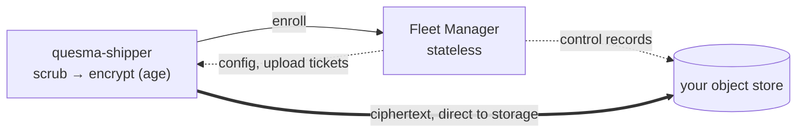

# Quesma Shipper

[](#install-the-shipper)

Quesma Shipper collects the session files that AI coding agents write on developer machines,
removes secrets and personal data from each file, encrypts it, and uploads the ciphertext to object
storage your organisation controls. It is two parts:

- **the shipper** ([`src/`](src/README.md)), a background service on each developer machine: one
  static binary for macOS, Linux and Windows;
- **[Fleet Manager](fleet-manager/)**, the control plane you run in your own cloud: it enrolls
  shippers, hands them their configuration, and signs each upload. It never sees file contents.


```mermaid
flowchart LR
    S["quesma-shipper<br/>scrub → encrypt (age)"]
    F["Fleet Manager<br/>stateless"]
    B[("your object store")]

    S -->|enroll| F
    F -.->|"config, upload tickets"| S
    F -.->|"control records"| B
    S ==>|"ciphertext, direct to storage"| B
```

Files are scrubbed and encrypted on the machine that wrote them, then uploaded straight to storage
through short-lived presigned URLs. Only the holders of the organisation's
[age](https://age-encryption.org/) keys can read what was uploaded. Supported agents: Claude Code,
Codex, Cursor. Supported platforms: macOS 13 or newer, Linux, Windows 10 1809 or newer.

The project is pre-1.0. The wire protocol, the configuration format, and the object naming are
versioned and pinned by tests. They can still change between minor releases.

## Get started

| You are | Start here |
| --- | --- |
| A developer whose organisation runs Fleet Manager | [Install the shipper](#install-the-shipper) |
| Setting Fleet Manager up for your organisation | [Run Fleet Manager](#run-fleet-manager) |
| Evaluating, with no cloud account | [On one machine](fleet-manager/README.md#on-one-machine) |

## Install the shipper

You need the address of your organisation's Fleet Manager and an enrollment token from its
administrator. Every download installs for the current user and needs no administrator rights.

**1. Install.**

| Platform | Install |
|---|---|
| macOS 13+ | `brew install --cask quesmaorg/tap/quesma-shipper`, or the signed [quesma-shipper-macos-universal.pkg](https://updates.quesma.dev/download/quesma-shipper-macos-universal.pkg) |
| Linux | `curl -fsSLO https://raw.githubusercontent.com/QuesmaOrg/quesma-shipper/main/src/packaging/linux/install.sh && sh install.sh` |
| Windows 10 1809+ | [QuesmaShipperSetup-amd64.exe](https://updates.quesma.dev/download/QuesmaShipperSetup-amd64.exe) for x64, [QuesmaShipperSetup-arm64.exe](https://updates.quesma.dev/download/QuesmaShipperSetup-arm64.exe) for Arm |

**2. Enroll** with the token and the address your administrator sent you:

```sh
quesma-shipper login <enrollment-token> --server https://fleet-manager.example.com
```

**3. Check** that it enrolled and received its configuration:

```sh
quesma-shipper doctor
```

The service ships on start and then every 15 minutes, and keeps itself up to date. Uninstalling,
managed deployment through MDM or Intune, what is collected, and how to pause or configure it are
in [the shipper's README](src/README.md).

## Run Fleet Manager

One script creates the bucket, the scoped roles, the service and the administrator credential in
your AWS account or Google Cloud project. You need Terraform 1.5 or later (or OpenTofu), `curl`,
`age-keygen`, and the `aws` or `gcloud` CLI signed in to the target account; no clone, no Go, no
Docker. On AWS the Region needs a default VPC, which ECS Express Mode requires.

**1. Collect two age recipients** from two custodians. Each generates their own identity and sends
you only the public `age1…` line. Files are sealed to these recipients and only their private
identities can open them, so keep those backed up: lose them all and the uploads are unreadable.

```sh
age-keygen -o acme-security.agekey     # the private identity -- never leaves the custodian
age-keygen -y acme-security.agekey     # prints the age1… recipient -- this is what you collect
```

**2. Decide whether Quesma may decrypt.** Uploads are also sealed to Quesma's recipient unless you
say otherwise, so that Quesma's dashboards can work once you grant it bucket access; on its own it
grants nothing. It cannot be added to files already uploaded, so decide now: add `--no-quesma-etl`
to the next command to turn it off for every organisation, or untick it per organisation in step 4.
The details are in the [Fleet Manager README](fleet-manager/README.md#administration).

**3. Deploy.** It shows the plan, asks before applying, and after a few minutes prints the service
URL, the admin UI address and the administrator credential:

```sh
curl -fsSLO https://raw.githubusercontent.com/QuesmaOrg/quesma-shipper/main/fleet-manager/deploy.sh

sh deploy.sh aws --bucket globally-unique-acme-trajectories --region eu-central-1
sh deploy.sh gcp --project acme-prod --region europe-central2
```

Everything it makes lives in `~/.quesma/fleet-manager/<cloud>/`, including the Terraform state:
back that directory up. Running the same command again upgrades; `sh deploy.sh aws output
admin_credential` prints the credential again; `sh deploy.sh --help` lists the rest. What the
script creates, and how to run the template by hand with your own image or your own state, is in
[fleet-manager/terraform/aws](fleet-manager/terraform/aws/README.md) and
[fleet-manager/terraform/gcp](fleet-manager/terraform/gcp/README.md).

**4. Create the organisation.** Open the admin UI, paste the credential, and create one: a
lowercase slug (`acme` below; it is permanent, part of every object key), a display name, the two
recipients from step 1, and the Quesma checkbox from step 2. Then confirm a custodian can decrypt
what is sealed to those recipients:

```sh
echo test | age -r age1… -r age1… -o test.age     # the two recipients you just registered
age -d -i acme-security.agekey test.age           # a custodian, with their private identity
```

**5. Invite the machines.** On the Invites page, create one invite per machine; its `fmi2.…` token
is shown once. A grant, on the Grants page, is the same for any number of machines. Send the token
and the service URL to each developer through a secret-sharing channel. They follow
[Install the shipper](#install-the-shipper), and appear on the Installs page as `active`.

**6. Check that it arrived.** The service ships on start and then every 15 minutes:

```sh
aws s3 ls --recursive "s3://$(sh deploy.sh aws output bucket)/v1/organization=acme/install=" | head
aws s3 cp "s3://<bucket>/<key from the listing>" object.age
age -d -i acme-security.agekey object.age | zstd -d | tar -t     # manifest.json, payload
```

Rotating the credential, revoking installs, upgrading, backups, and letting an outside ETL read
the bucket are in [fleet-manager/OPERATIONS.md](fleet-manager/OPERATIONS.md).

## Learn more

- [src/README.md](src/README.md): the shipper; [fleet-manager/README.md](fleet-manager/README.md):
  the control plane; [fleet-manager/OPERATIONS.md](fleet-manager/OPERATIONS.md): operating it.
- [CONSTITUTION.md](CONSTITUTION.md): the design rules; [ARCHITECTURE.md](ARCHITECTURE.md): the code
  layout; [CONTRIBUTING.md](CONTRIBUTING.md): building, testing and releases. The wire contract is
  the public [shipper-protocol](https://github.com/QuesmaOrg/shipper-protocol) module.
- [SECURITY.md](SECURITY.md): reporting a vulnerability. Do not attach real trajectories, agent
  databases, logs or credentials to issues or pull requests.

## License

Apache License 2.0. See [LICENSE](LICENSE) and [NOTICE](NOTICE). `quesma-shipper licenses` prints the
license and every bundled dependency's license text; Fleet Manager keeps its own in
[fleet-manager/NOTICE](fleet-manager/NOTICE) and `fleet-manager/third_party/`. Quesma, Quesma
Shipper, Quesma Fleet Manager, and the Quesma logo are trademarks of Quesma Inc.; the license does
not grant trademark rights. If you distribute a modified build, read [TRADEMARKS.md](TRADEMARKS.md)
before you name it.
